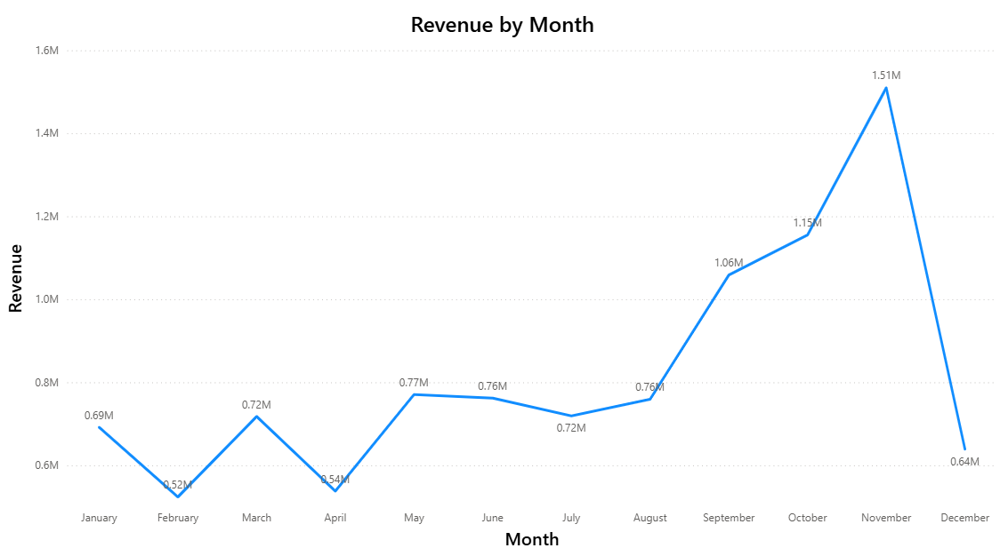
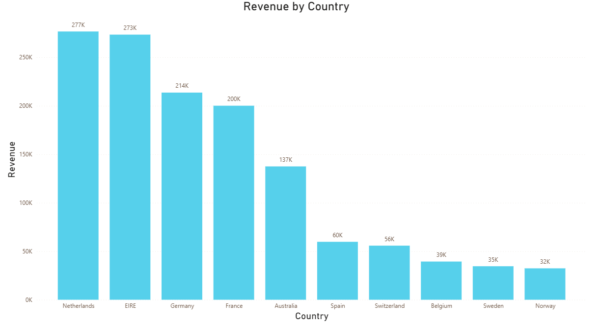
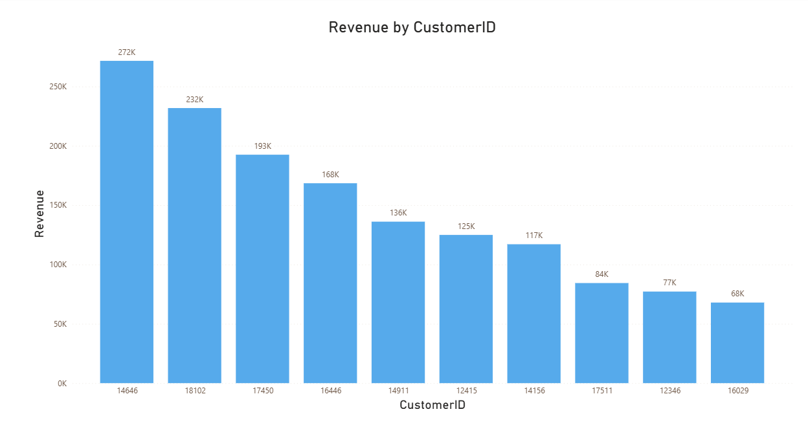
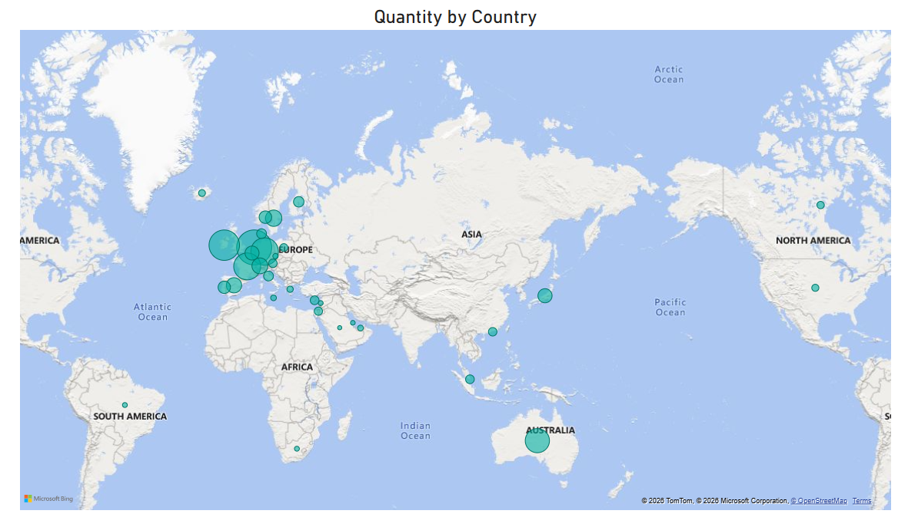

# 📊 Tata Data Visualization Virtual Internship Project

A business-focused Power BI dashboard project analyzing over 500,000 online retail transactions to uncover revenue trends, customer behavior, and regional demand insights for executive stakeholders.

---


---

# 🧠 Project Overview

This project was completed as part of the **Tata Group Data Visualization Virtual Internship** hosted on Forage.

The objective of this project was to analyze online retail transaction data and generate actionable business insights for executive stakeholders including the CEO and CMO.

Using Power BI, the project focused on:
- Data cleaning and preprocessing
- Revenue trend analysis
- Customer behavior analysis
- Regional demand analysis
- Business-focused storytelling through dashboards

The dataset contains over **500,000 retail transaction records** from multiple countries.

---

# 🧹 Data Cleaning & Preparation

Before beginning the analysis, the dataset was cleaned to ensure accurate and reliable insights.

### Cleaning steps performed:
- Removed records where `Quantity < 1`
- Removed records where `UnitPrice < 0`
- Checked and handled missing values
- Created revenue calculations using:
  
```DAX
Revenue = Quantity × UnitPrice
```

These preprocessing steps ensured the analysis reflected genuine business activity.

---

# 📈 Business Questions Solved

## 1️⃣ Revenue Trends in 2011

### Objective
Analyze monthly revenue trends for 2011 to identify seasonality and forecasting opportunities.

### Visualization Used
📈 Line Chart

### Key Insight
- Revenue remained relatively stable from January to July
- Significant spike observed during November due to holiday season demand

### Business Impact
Helps leadership forecast inventory demand and optimize seasonal marketing strategies.

---

## 2️⃣ Top 10 Revenue-Generating Countries (Excluding UK)

### Objective
Identify countries generating the highest revenue and quantity sold.

### Visualization Used
📊 Stacked Bar Chart

### Key Insight
Top-performing countries included:
- Netherlands
- Germany
- France
- Ireland

### Business Impact
Supports region-specific marketing campaigns and expansion strategies.

---

## 3️⃣ Top 10 Customers by Revenue

### Objective
Identify high-value customers for retention and loyalty initiatives.

### Visualization Used
📊 Horizontal Bar Chart

### Key Insight
- Highest revenue-generating customer contributed over £280K
- Multiple customers consistently exceeded £150K revenue

### Business Impact
Enables targeted loyalty programs and personalized customer engagement.

---

## 4️⃣ Product Demand by Country (Excluding UK)

### Objective
Identify regions with the strongest product demand for business expansion opportunities.

### Visualization Used
🗺️ Map Visualization

### Key Insight
Highest demand observed in:
- Germany
- Netherlands
- France

Emerging opportunities identified in:
- Spain
- Switzerland

### Business Impact
Supports strategic regional expansion planning.

---

# 📊 Dashboard Preview

| Revenue Trend | Top Countries |
|---|---|
|  |  |

| Top Customers | Country Demand |
|---|---|
|  |  |

---

# 🔍 Key Insights

- Seasonal sales peaked significantly during November
- European countries dominated international revenue generation
- A small segment of customers contributed disproportionately high revenue
- Strong regional demand patterns revealed expansion opportunities

---

# 🛠️ Tools & Technologies Used

- Power BI
- Excel
- DAX
- Data Cleaning
- Data Visualization
- Business Analysis

---

# 📂 Repository Structure

```bash
tata-data-visualization-project/
│
├── dashboard/
│   └── tata_dashboard.pbix
│
├── visuals/
│   ├── q1_revenue_trend.png
│   ├── q2_top_countries.png
│   ├── q3_top_customers.png
│   └── q4_country_demand.png
│
├── data/
│   └── online_retail_cleaned.csv
│
├── documents/
│   └── tata-forage-internship-certificate.png
│
└── README.md
```

---

# 🚀 Key Learning Outcomes

Through this project, I strengthened my skills in:
- Data cleaning and preprocessing
- Business-oriented dashboard development
- Executive-level data storytelling
- Data-driven decision making
- Stakeholder-focused analysis

---

# 📜 Certification

This project was completed as part of the Tata Group Data Visualization Virtual Experience Program on Forage.

---

# 🤝 Connect With Me

## LinkedIn
www.linkedin.com/in/rassalresheed

## GitHub
www.github.com/rassal05

---

⭐ If you found this project interesting, feel free to explore the repository and connect with me!
